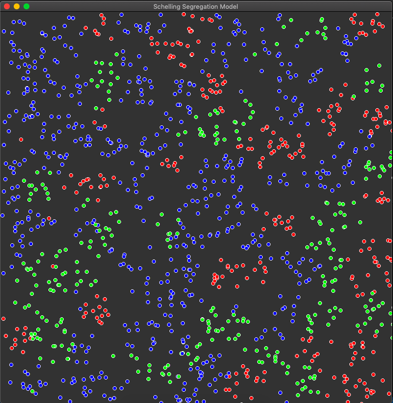
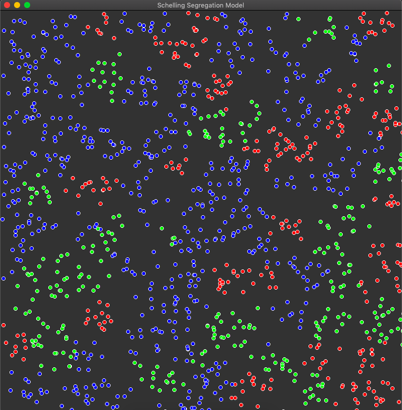
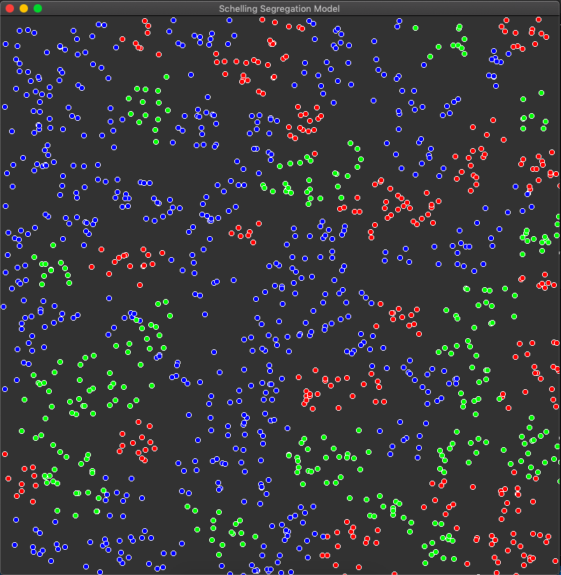

# Schelling Segregation Model
Model of segregation in a population based on a preference for neighbors being the same "type" or "race" as you. This model goes to show how even a slight preference can cause larger macroscopic segregation in population distribution.

This was written in C++ using the SFML library. Uses multithreading and number of threads can be customized in GlobalSettings.h.

Can change number of races, number of cells per race, and other parameters in GlobalSettings.h, then recompile using make to run simulation. Press spacebar to go to next cycle and press R to restart with a new random placement.

The following is a simulation with each cell's tolerance=0.5 and neighbors=10 meaning that if more than half of one's neighbors are of different type/race, the cell becomes unhappy and moves elsewhere.

## Cycle 1

 
Initially, each cell is in a random position and there is no apparent segregation.

## Cycle 2

 
After just a cycle, there are already very apparent patterns of segregation.

## Cycle 3

 
Compared to the previous cycle, not as many cells are unhappy since they are all together.

## Cycle 4

 
Cells have pretty much settled down in their respect regions.
