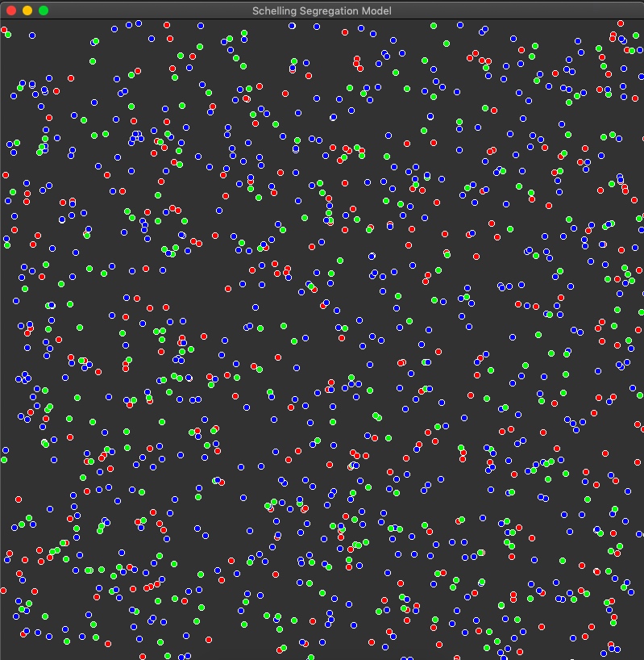
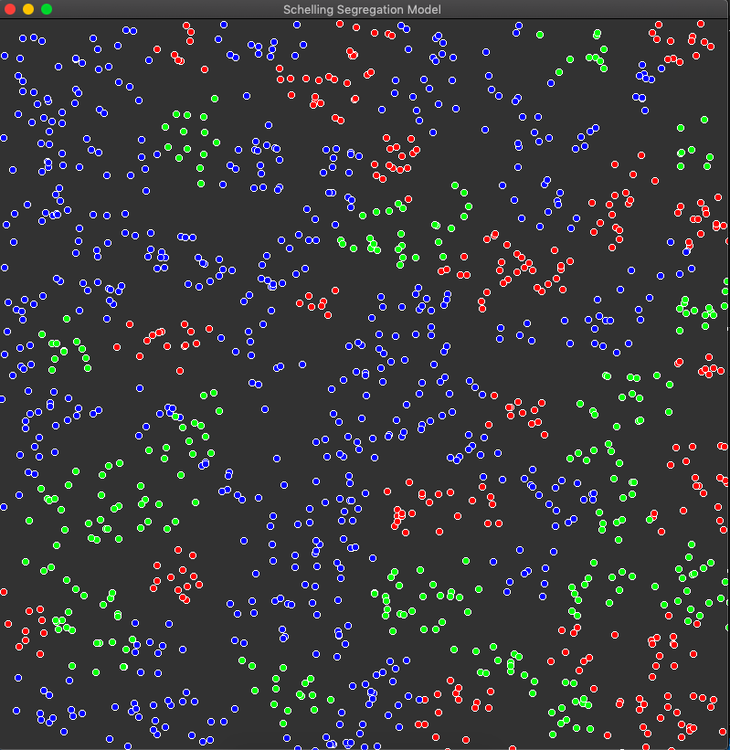

# Schelling Segregation Model
Model of segregation in a population based on a preference for neighbors being the same "type" or "race" as you. This model goes to show how even a slight preference can cause larger macroscopic segregation in population distribution.

This was written in C++ using the SFML library. 

